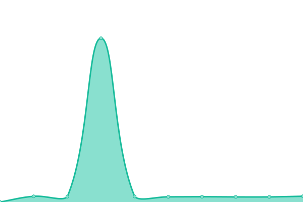

# [📈 Live Status](https://up.nyase.ru): <!--live status--> **🟧 Partial outage**

This repository contains the open-source uptime monitor and status page for [Nyaser](https://nyaser.top), powered by [Upptime](https://github.com/upptime/upptime).

With [Upptime](https://upptime.js.org), you can get your own unlimited and free uptime monitor and status page, powered entirely by a GitHub repository. We use [Issues](https://github.com/ProjectNyaser/upptime/issues) as incident reports, [Actions](https://github.com/ProjectNyaser/upptime/actions) as uptime monitors, and [Pages](https://up.nyase.ru) for the status page.

<!--start: status pages-->
<!-- This summary is generated by Upptime (https://github.com/upptime/upptime) -->
<!-- Do not edit this manually, your changes will be overwritten -->
<!-- prettier-ignore -->
| URL | Status | History | Response Time | Uptime |
| --- | ------ | ------- | ------------- | ------ |
|  [AList](https://a.nyase.ru) | 🟩 Up | [a-list.yml](https://github.com/ProjectNyaser/upptime/commits/HEAD/history/a-list.yml) | 

 699ms
     
 | 

<a href="https://up.nyase.ru/history/a-list">100.00%</a>
    

|  [AriaNg](https://an.nyase.ru) | 🟩 Up | [aria-ng.yml](https://github.com/ProjectNyaser/upptime/commits/HEAD/history/aria-ng.yml) | 

 1858ms
     
 | 

<a href="https://up.nyase.ru/history/aria-ng">100.00%</a>
    

|  [Cloudreve](https://c.nyase.ru) | 🟩 Up | [cloudreve.yml](https://github.com/ProjectNyaser/upptime/commits/HEAD/history/cloudreve.yml) | 

 677ms
     
 | 

<a href="https://up.nyase.ru/history/cloudreve">100.00%</a>
    

|  [Cockpit](https://u.nyase.ru) | 🟥 Down | [cockpit.yml](https://github.com/ProjectNyaser/upptime/commits/HEAD/history/cockpit.yml) | 

 0ms
     
 | 

<a href="https://up.nyase.ru/history/cockpit">0.00%</a>
    

<!--end: status pages-->

[**Visit our status website →**](https://up.nyase.ru)

## 📄 License

- Powered by: [Upptime](https://github.com/upptime/upptime)
- Code: [MIT](./LICENSE) © [Anand Chowdhary](https://anandchowdhary.com), supported by [Pabio](https://pabio.com)
- Data in the `./history` directory: [Open Database License](https://opendatacommons.org/licenses/odbl/1-0/)
